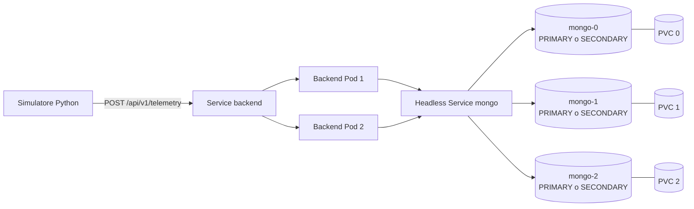

# BikeFlow

BikeFlow è un progetto didattico di sistemi distribuiti per acquisire, conservare e
interrogare la telemetria simulata di una flotta bike-sharing. Comprende un simulatore
Python, un'API FastAPI, un replica set MongoDB a tre membri, un ambiente Docker Compose e
manifest Kubernetes per kind o Minikube. Non include interfacce grafiche né broker o servizi
cloud.

## Architettura



L'API scrive con write concern `majority`, usa il replica set `rs0` e crea automaticamente:

- l'indice univoco `uq_event_id` su `event_id`;
- l'indice composto `bike_recorded_at` su `bike_id ASC, recorded_at DESC`;
- un indice ausiliario per le query per stazione.

Un primo `event_id` produce HTTP `201` e `outcome: created`. Un reinvio identico produce
HTTP `200` e `outcome: duplicate`; una collisione con payload diverso produce HTTP `409`.
La violazione dell'indice durante richieste concorrenti viene intercettata e riletta da MongoDB.
I timestamp vengono convertiti in UTC e canonicalizzati al millisecondo, precisione nativa BSON.

Le motivazioni progettuali sono approfondite in [docs/architecture.md](docs/architecture.md).

## Struttura

```text
backend/app/                 API, modelli, configurazione, log e repository MongoDB
simulator/                   generatore configurabile e client con retry
tests/unit/                  test senza dipendenze esterne
tests/integration/           test reali del replica set, attivati esplicitamente
docker/                      Dockerfile backend, simulatore e test
k8s/                         risorse Kubernetes e Job di inizializzazione
k8s/optional/                Job simulatore applicabile su richiesta
scripts/experiments/         carico, self-healing, failover e verifica dati
docs/                        architettura, protocollo sperimentale e bozza d'esame
compose.yaml                 ambiente locale completo
pyproject.toml               configurazione pytest, coverage e Ruff
```

## Prerequisiti

- Python 3.12 o successivo;
- Docker Engine/Desktop con Compose v2 per il percorso locale;
- `kubectl` e uno tra kind e Minikube per il percorso Kubernetes;
- almeno 4 GB di memoria disponibili per il cluster locale.

Non sono necessarie credenziali. L'ambiente è intenzionalmente privo di autenticazione e va
usato solo in locale.

## Avvio con Docker Compose

Un solo comando costruisce il backend, avvia i tre nodi MongoDB, inizializza in modo idempotente
il replica set e pubblica l'API:

```bash
docker compose up --build -d
```

Controllo dello stato:

```bash
docker compose ps
curl --fail http://localhost:8000/health/ready
```

OpenAPI è disponibile a <http://localhost:8000/docs> e lo schema JSON a
<http://localhost:8000/openapi.json>.

Per mostrare i tre membri e il primary corrente:

```bash
docker compose exec -T mongo-1 mongosh --quiet --eval \
  'printjson(rs.status().members.map(m => ({name: m.name, state: m.stateStr, health: m.health})))'
```

Il simulatore è escluso dall'avvio ordinario. Si esegue esplicitamente tramite il profilo:

```bash
SIM_BIKES=50 \
SIM_EVENTS_PER_SECOND=10 \
SIM_DURATION_SECONDS=60 \
SIM_SEED=42 \
SIM_DUPLICATE_PROBABILITY=0.10 \
SIM_ANOMALY_PROBABILITY=0.05 \
docker compose --profile simulation run --rm simulator
```

Le probabilità sono comprese tra `0` e `1`. La frequenza è globale, in eventi al secondo. Il
simulatore effettua retry limitati con backoff esponenziale e jitter e conserva payload e
`event_id` originali durante ogni retry.

## API ed esempi

Evento valido:

```bash
curl --fail-with-body -X POST http://localhost:8000/api/v1/telemetry \
  -H 'content-type: application/json' \
  -d '{
    "event_id":"11111111-1111-4111-8111-111111111111",
    "bike_id":"bike-0001",
    "station_id":"station-centro",
    "latitude":41.9028,
    "longitude":12.4964,
    "battery_pct":88,
    "status":"available",
    "recorded_at":"2026-09-04T12:00:00Z"
  }'
```

Query con filtri e paginazione limitata (`limit` massimo 100):

```bash
curl 'http://localhost:8000/api/v1/telemetry?bike_id=bike-0001&status=available&limit=20&offset=0'
curl http://localhost:8000/api/v1/bikes/bike-0001/latest
curl 'http://localhost:8000/api/v1/bikes/bike-0001/history?limit=20'
curl 'http://localhost:8000/api/v1/stations/summary?station_id=station-centro'
```

Sono disponibili anche i filtri `station_id`, `recorded_from` e `recorded_to`; i timestamp di
filtro devono includere un offset o `Z`.

### Variabili del backend

| Variabile | Default locale Python | Significato |
|---|---:|---|
| `MONGO_URI` | `mongodb://localhost:27017/?replicaSet=rs0&retryWrites=true` | URI del replica set |
| `MONGO_DATABASE` | `bikeflow` | database |
| `MONGO_COLLECTION` | `telemetry` | collection |
| `MONGO_SERVER_SELECTION_TIMEOUT_MS` | `2000` | timeout selezione server |
| `MONGO_CONNECT_TIMEOUT_MS` | `2000` | timeout connessione |
| `MONGO_WRITE_TIMEOUT_MS` | `5000` | timeout write concern |
| `LOG_LEVEL` | `INFO` | livello dei log JSON |

`/health/live` verifica soltanto il processo. `/health/ready` esegue un ping reale a MongoDB e
restituisce `503` quando il database non è disponibile.

## Test e qualità

Installazione isolata e test unitari:

```bash
python3 -m venv .venv
.venv/bin/python -m pip install -r requirements-dev.txt
.venv/bin/ruff check backend simulator tests
.venv/bin/ruff format --check backend simulator tests
.venv/bin/pytest -m 'not integration'
```

I test d'integrazione vengono eseguiti dentro la rete Compose e verificano MongoDB reale,
inclusi inserimento concorrente, indice univoco, latest, aggregazione e tre membri del replica
set:

```bash
docker compose --profile test run --rm tests
```

In alternativa, in un ambiente che risolve tutti gli hostname dichiarati nel replica set:

```bash
MONGO_TEST_URI='mongodb://mongo-1:27017,mongo-2:27017,mongo-3:27017/?replicaSet=rs0' \
  .venv/bin/pytest -m integration
```

## Kubernetes locale

I manifest usano namespace `bikeflow`, StatefulSet MongoDB a tre repliche, PVC separati,
headless Service, Job idempotente di inizializzazione, Deployment backend a due repliche,
Service ClusterIP, probe e limiti di risorse. Nessun Ingress è necessario.

### kind

```bash
kind create cluster --name bikeflow
docker build -f docker/backend.Dockerfile -t bikeflow-backend:local .
docker build -f docker/simulator.Dockerfile -t bikeflow-simulator:local .
kind load docker-image --name bikeflow bikeflow-backend:local bikeflow-simulator:local
kubectl apply -k k8s
kubectl -n bikeflow wait --for=condition=complete job/mongo-rs-init --timeout=180s
kubectl -n bikeflow rollout status statefulset/mongo --timeout=180s
kubectl -n bikeflow rollout status deployment/backend --timeout=180s
```

### Minikube

```bash
minikube start
docker build -f docker/backend.Dockerfile -t bikeflow-backend:local .
docker build -f docker/simulator.Dockerfile -t bikeflow-simulator:local .
minikube image load bikeflow-backend:local
minikube image load bikeflow-simulator:local
kubectl apply -k k8s
kubectl -n bikeflow wait --for=condition=complete job/mongo-rs-init --timeout=180s
kubectl -n bikeflow rollout status deployment/backend --timeout=180s
```

Accesso dal computer locale, da lasciare attivo in un terminale:

```bash
kubectl -n bikeflow port-forward service/backend 8000:8000
```

Il simulatore Kubernetes è opzionale:

```bash
kubectl apply -f k8s/optional/simulator-job.yaml
kubectl -n bikeflow logs -f job/simulator
```

Per rilanciare un Job con lo stesso nome, eliminarlo esplicitamente nel solo namespace
`bikeflow` e riapplicare il manifest.

## Esperimenti di guasto

Il protocollo completo, le metriche e le tabelle di raccolta sono in
[docs/experiments.md](docs/experiments.md).

Carico Compose configurabile:

```bash
SIM_DURATION_SECONDS=120 SIM_EVENTS_PER_SECOND=20 scripts/experiments/load.sh
```

Failover MongoDB in Compose; lo script identifica il primary, ferma soltanto quel servizio,
attende un primary diverso, verifica conteggio e duplicati e riavvia il membro:

```bash
scripts/experiments/compose-mongo-failover.sh
```

Self-healing del backend Kubernetes:

```bash
scripts/experiments/backend-recovery.sh
```

Failover del primary MongoDB Kubernetes e verifica dei dati:

```bash
scripts/experiments/mongo-failover.sh
scripts/experiments/verify-data.sh
```

Gli script Kubernetes hanno namespace `bikeflow` non configurabile, validano il nome della
risorsa prima della cancellazione e non eseguono comandi distruttivi generici.

## Pulizia

Arresto Compose conservando i dati:

```bash
docker compose down
```

Eliminazione esplicita anche dei tre volumi Compose:

```bash
docker compose down --volumes
```

Pulizia Kubernetes limitata al progetto o eliminazione del cluster kind dedicato:

```bash
kubectl delete namespace bikeflow
kind delete cluster --name bikeflow
```

## Verifiche effettuate il 4 settembre 2026

Nell'ambiente di sviluppo corrente sono stati verificati realmente:

- Python 3.12.2: 25 test unitari superati; lint e format Ruff superati;
- Docker Desktop 28.0.4 e Compose 2.34.0: tre immagini costruite;
- stack Compose avviato con un solo comando e tutti i servizi healthy;
- replica set `rs0`: un primary e due secondary sani;
- 3 test d'integrazione su MongoDB reale superati;
- POST, duplicato idempotente, query, aggregazione, readiness e indici verificati;
- simulatore: 8 richieste, 6 create, 2 duplicate, 0 fallite;
- failover Compose: primary passato da `mongo-1` a `mongo-2`, 13 documenti conservati e
  0 gruppi `event_id` duplicati; il membro fermato è rientrato come secondary;
- `docker compose config`, sintassi shell e rendering `kubectl kustomize k8s` superati.

`kubectl` 1.32.2 era presente, ma kind e Minikube non erano installati e non esisteva un
context Kubernetes: il deployment e il failover Kubernetes non sono quindi dichiarati come
eseguiti. I manifest sono stati renderizzati e validati localmente, non provati da un API server.

## Limitazioni note

- Nessuna autenticazione, TLS, cifratura applicativa, backup o restore automatico.
- Nessun autoscaling, PodDisruptionBudget, monitoring esterno o tracing distribuito.
- Le aggregazioni operano sull'intera telemetria selezionata: non sono ottimizzate per volumi
  industriali.
- Un cluster kind/Minikube su un solo computer dimostra replica, elezione e self-healing dei
  processi, ma non tollera il guasto del computer fisico.
- Le risorse privilegiano leggibilità e riproducibilità didattica rispetto all'hardening di
  produzione. Vedere [docs/architecture.md](docs/architecture.md) per i compromessi.
